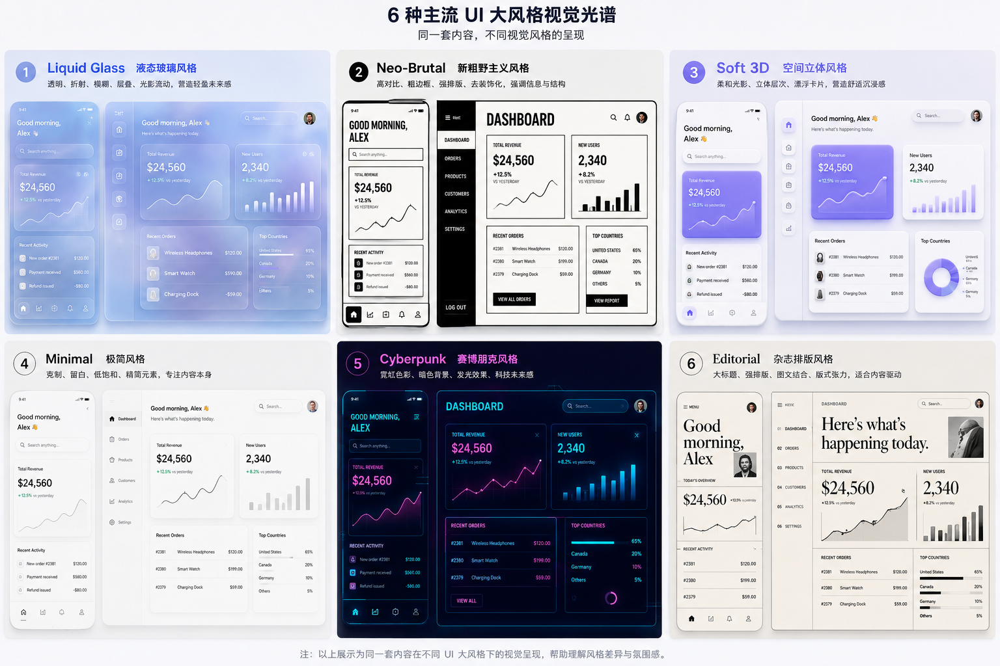

### UI构成
- L1	交互范式	界面如何被生成与交互	GUI、触摸、GenUI	数十年一遇
- L2	大风格 / 设计语言	全部视觉维度：材质、形态、色彩、层次、动效、字体、图标	液态玻璃、Material 3、Fluent	5–10 年，平台级
- L3	趋势级风格	只管 1–2 个维度	超色彩（只管色彩）、动态排版（只管动效）、果冻感（材质+形态）	1–3 年
- L4	要素 / 手法	单一具体处理	内阴影、毛玻璃模糊值、按压微动效	随用随取

# 6 种主流 UI 大风格

同一套产品内容，可以通过完全不同的视觉语言，呈现出截然不同的产品气质。以下 6 种风格代表当前 UI 设计中比较有辨识度的主流视觉方向。

---

## 1. Liquid Glass｜液态玻璃

**关键词：** 透明、玻璃、折射、模糊、光影、层叠、流动

以半透明材质和玻璃质感为核心，通过背景透视、Backdrop Blur、光线折射、高光、渐变和多层叠加制造空间感。

**视觉特征：**

* 大量半透明 / 半透色面
* 强烈的背景模糊与景深
* Glass Card、Floating Panel、透明导航
* 边缘高光、柔和阴影、光线折射
* 背景与前景产生明显的空间层次
* UI 元素像漂浮在玻璃表面

**适合：**

* 高端消费产品
* AI 产品
* 音乐 / 娱乐
* 智能设备
* 科技品牌
* 强调未来感和沉浸感的产品

**一句话形容：**

> 像把 UI 做成一层层漂浮、折射光线的透明玻璃。

---

## 2. Neo-Brutalism｜新粗野主义

**关键词：** 高对比、粗边框、硬阴影、巨大字体、几何、反精致

通过强烈的视觉冲突和刻意的不精致感建立辨识度。拒绝过度柔和与装饰，强调结构、信息和视觉冲击。

**视觉特征：**

* 黑白或高对比配色
* 粗黑边框
* 明显的硬阴影
* 巨大、粗重的 Typography
* 矩形和几何形状
* 不规则布局
* 大面积纯色
* 强烈的视觉撞色

**适合：**

* 创意工具
* 独立品牌
* 艺术 / 设计产品
* 年轻消费品牌
* Portfolio
* 创作者社区

**一句话形容：**

> 像把网页设计从“精致装修”变成了一张贴满海报的设计工作台。

---

## 3. Soft 3D / Spatial｜柔和空间立体风

**关键词：** 3D、空间、漂浮、柔光、立体、物体感、柔和阴影

通过 3D 元素、浮动卡片、柔和光影和空间层级，让 UI 从二维平面变成具有“物理空间”的界面。

**视觉特征：**

* 3D 图标和 3D Illustration
* 漂浮式 Card
* 柔和的大面积阴影
* 圆润的几何形状
* 柔和渐变
* 前后景深
* UI 元素具有明显的 Z 轴层级
* 像物体一样“摆放”在空间中

**适合：**

* AI 产品
* 教育产品
* 儿童 / 家庭产品
* 金融科技
* 创意工具
* 新消费品牌

**一句话形容：**

> 像把 UI 从屏幕里拿出来，变成一组摆在桌面上的数字物体。

---

## 4. Minimalism｜极简主义

**关键词：** 留白、克制、秩序、Typography、低饱和、内容优先

通过减少视觉装饰，将注意力集中在内容、信息结构和交互本身。不是“什么都没有”，而是让每一个元素都经过严格取舍。

**视觉特征：**

* 大量留白
* 简洁的 Grid
* 低饱和色彩
* 轻量级阴影
* 简单几何形状
* 清晰的 Typography 层级
* 极少装饰
* 强调信息密度与阅读体验

**适合：**

* SaaS
* 效率工具
* 企业产品
* 数据产品
* 内容平台
* 专业工具

**一句话形容：**

> 把所有不必要的东西拿掉，只留下最重要的信息和操作。

---

## 5. Cyberpunk｜赛博朋克

**关键词：** 暗色、霓虹、发光、科技、HUD、数字感、未来

通过深色背景、霓虹色、发光效果和科技感图形建立强烈的未来世界观。

**视觉特征：**

* 黑色 / 深色背景
* Neon Glow
* 青色、紫色、粉色等霓虹色
* 发光边框
* HUD / Sci-Fi 界面
* 数据流和网格
* 科技感 Typography
* 强烈的对比和视觉冲击

**适合：**

* 游戏
* AI
* Web3
* 加密货币
* 科技实验产品
* 音乐 / 夜生活
* 年轻化品牌

**一句话形容：**

> 像从未来城市的控制台里直接截出来的一块 UI。

---

## 6. Editorial｜杂志 / 编辑排版风

**关键词：** 大标题、强排版、网格、图片、文字、版式、内容驱动

借鉴杂志、报纸和高级出版物的视觉语言，把 Typography 和 Layout 本身作为主要视觉元素。

**视觉特征：**

* 巨大标题
* 强烈的字体对比
* Magazine Grid
* 多栏排版
* 图片与文字组合
* 非对称布局
* 细线、编号、注释
* 强调视觉节奏和版式张力

**适合：**

* 内容平台
* 媒体
* 时尚品牌
* 艺术 / 文化产品
* Portfolio
* 高端品牌官网

**一句话形容：**

> 像一本高级杂志被重新设计成了可以交互的数字界面。

---

# 六种风格的核心区别

| 风格                    | 核心视觉              | 第一眼感受     | 辨识度   |
| --------------------- | ----------------- | --------- | ----- |
| **Liquid Glass**      | 透明 + 折射 + 模糊      | 未来、轻盈、奢华  | ★★★★★ |
| **Neo-Brutalism**     | 粗边框 + 高对比         | 强烈、叛逆、年轻  | ★★★★★ |
| **Soft 3D / Spatial** | 3D + 空间 + 柔光      | 友好、立体、沉浸  | ★★★★☆ |
| **Minimalism**        | 留白 + 秩序           | 干净、专业、高级  | ★★★☆☆ |
| **Cyberpunk**         | 霓虹 + 暗色 + Glow    | 科技、未来、刺激  | ★★★★★ |
| **Editorial**         | Typography + Grid | 高级、文化、内容感 | ★★★★☆ |

## 一个简单的判断方式

如果把**同一个 Dashboard**分别套进这六种风格：

* **Liquid Glass** → “这东西是玻璃做的”
* **Neo-Brutalism** → “这东西很大胆”
* **Soft 3D** → “这东西有空间”
* **Minimalism** → “这东西很克制”
* **Cyberpunk** → “这东西来自未来”
* **Editorial** → “这东西像一本杂志”

这才比较接近“**大风格**”的概念。

> Material 3、Fluent 等更适合作为“设计系统 / UI 语言”单独讨论，而不是与上述视觉风格完全等价地并列。

