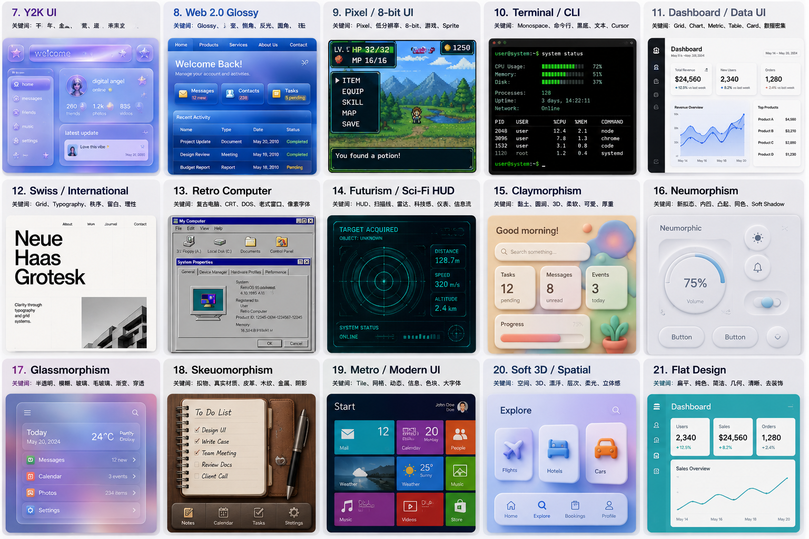

# 15 种经典 UI 大风格

> 以下风格主要描述 UI 的**视觉语言与表现方式**，不等同于 Material 3、Fluent 等具体设计系统。

---

## 7. Y2K UI｜千禧年数字风

**关键词：** 千禧年、未来主义、金属、透明塑料、Glossy、蓝紫、气泡

受 1990s 末至 2000s 初数字文化影响，以“当时的人想象未来”为核心。

**视觉特征：**

* 金属与 Chrome 材质
* 半透明塑料
* 蓝紫、银色、彩虹渐变
* Glossy 高光
* 气泡、星星、流线型装饰
* 3D 字体与按钮
* 强烈的早期互联网 / 数字未来感

**一句话：**

> 这是 2000 年的人想象未来电脑会长什么样。

---

## 8. Web 2.0 Glossy｜Web 2.0 光泽风

**关键词：** Glossy、渐变、倒角、圆角、反光、按钮、Drop Shadow

2000s 互联网产品最典型的视觉语言之一。

**视觉特征：**

* 蓝色 / 彩色渐变
* 大圆角
* Glossy 高光按钮
* 倒角与立体边缘
* 明显 Drop Shadow
* 3D 小图标
* 强烈的“可点击感”

**一句话：**

> 一切东西都像刚打过蜡，闪闪发亮。

---

## 9. Pixel / 8-bit UI｜像素风

**关键词：** Pixel、8-bit、低分辨率、Sprite、游戏、复古

直接把像素和低分辨率作为设计语言。

**视觉特征：**

* Pixel Font
* 像素图标
* 硬边缘
* 有限色板
* Sprite
* RPG / 游戏 HUD
* 低分辨率插画

**一句话：**

> 不隐藏像素，而是让像素成为 UI 的核心视觉元素。

---

## 10. Terminal / CLI｜终端机风格

**关键词：** Monospace、Command Line、黑底、文本、Cursor、代码

以传统命令行和终端为视觉原型。

**视觉特征：**

* 黑色 / 深色背景
* 等宽字体
* 文本优先
* 命令行 Prompt
* ASCII 图形
* Cursor
* 绿色 / 琥珀色等终端色彩

**一句话：**

> UI 几乎消失，只留下信息、命令和光标。

---

## 11. Dashboard / Data UI｜数据仪表盘

**关键词：** Grid、Chart、Metric、Table、KPI、Card、Dense Information

围绕大量数据与高频操作建立的功能型 UI。

**视觉特征：**

* Dashboard Grid
* KPI Cards
* Charts
* Tables
* Filters
* Sidebar
* Dense Information
* 清晰的信息层级

**一句话：**

> 把复杂的数据压缩成一个可以快速扫描和操作的控制中心。

---

## 12. Swiss / International｜瑞士国际主义

**关键词：** Grid、Typography、秩序、理性、留白、非对称

源自瑞士国际主义平面设计，是现代数字设计的重要视觉基础。

**视觉特征：**

* 严格 Grid
* 强 Typography
* 大字号标题
* 非对称布局
* 大量留白
* Sans-serif
* 黑白 + 少量强调色
* 极少装饰

**一句话：**

> 用 Grid 和 Typography 建立秩序，而不是依靠装饰制造视觉效果。

---

## 13. Retro Computer｜复古电脑风

**关键词：** CRT、DOS、Windows 95、Macintosh Classic、低分辨率、复古

直接模拟早期个人电脑的操作界面。

**视觉特征：**

* 灰色窗口
* 像素图标
* 老式菜单
* CRT 扫描线
* 低分辨率
* 复古窗口边框
* 经典桌面 UI

**一句话：**

> 像打开了一台 1990 年代的电脑。

---

## 14. Futurism / Sci-Fi HUD｜科幻 HUD

**关键词：** HUD、雷达、扫描线、数据流、仪表、科技、控制台

模拟飞船、军事系统、科幻电影中的数字控制界面。

**视觉特征：**

* HUD
* Radar
* Targeting System
* 数据流
* 网格
* 扫描线
* 科技感字体
* 青色 / 蓝色发光界面

**一句话：**

> 像宇宙飞船驾驶舱里的控制面板。

---

## 15. Claymorphism｜黏土拟态

**关键词：** 黏土、圆润、3D、柔软、Pastel、厚重、可爱

通过圆润的 3D 物体和柔软阴影，让 UI 看起来像由黏土或软塑料制成。

**视觉特征：**

* 超大圆角
* 厚重 Card
* 3D Icon
* 柔和阴影
* Pastel 色彩
* 圆润几何
* 柔软、可爱的视觉感

**一句话：**

> 像一套由软黏土捏出来的数字界面。

---

## 16. Neumorphism｜新拟态

**关键词：** 凸起、内凹、Soft Shadow、同色背景、实体感

通过光影而不是边框制造 UI 元素的形体。

**视觉特征：**

* UI 与背景使用相近颜色
* 柔和阴影
* 凸起按钮
* 内凹输入框
* 极少使用边框
* 强调“从材料中压出来”的感觉

**一句话：**

> 所有按钮都像从同一块材料里压出来或凹进去。

---

## 17. Glassmorphism｜玻璃拟态

**关键词：** 半透明、Blur、玻璃、渐变、背景穿透、Glow

通过透明度和模糊制造玻璃层叠效果。

**视觉特征：**

* 半透明 Card
* Backdrop Blur
* 渐变背景
* 背景穿透
* 白色半透明边框
* 柔和 Glow
* 多层玻璃叠加

**一句话：**

> 像把一块半透明磨砂玻璃放在彩色背景上。

---

## 18. Skeuomorphism｜拟物主义

**关键词：** 真实材质、皮革、木头、金属、纸张、真实阴影

让数字 UI 模拟现实世界中的物品。

**视觉特征：**

* 真实材质纹理
* 皮革
* 木头
* 金属
* 纸张
* 真实按钮
* 真实光影
* 拟真的物理结构

**一句话：**

> 数字世界里的东西，尽可能长得像现实世界里的东西。

---

## 19. Metro / Modern UI｜现代信息界面

**关键词：** Tile、Typography、Grid、动态、信息、色块、大字

以 Windows Phone / Windows 8 时代为代表的现代主义数字 UI。

**视觉特征：**

* 大面积 Tile
* 强 Typography
* 色块
* Grid
* 大字号
* 动态信息
* 极少拟物装饰

**一句话：**

> UI 不是按钮集合，而是一张可以实时变化的信息版面。

---

## 20. Soft 3D / Spatial｜柔和空间立体风

**关键词：** 3D、空间、漂浮、柔光、层级、立体、Depth

通过空间关系和 3D 元素增强界面的物理感。

**视觉特征：**

* 3D Icon
* Floating Card
* 柔和阴影
* Gradient
* Depth
* 前后景深
* Z-axis 层级
* 漂浮元素

**一句话：**

> 把二维 UI 变成一组漂浮在空间中的数字物体。

---

## 21. Flat Design｜扁平化

**关键词：** 平面、纯色、几何、简洁、无纹理、少阴影

作为 Skeuomorphism 的反方向发展起来的设计语言。

**视觉特征：**

* 纯色
* 简单几何形状
* 极少纹理
* 极少渐变
* 极少阴影
* 清晰 Icon
* 简洁 Typography

**一句话：**

> 不模拟现实，UI 就应该直接呈现为数字图形。
